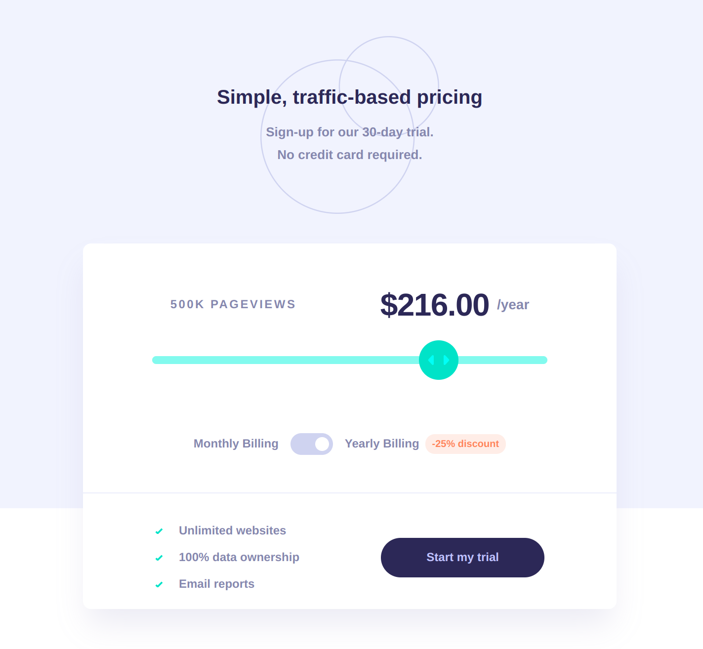

# Interactive pricing component - React + TypeScript

## Table of contents

- [Overview](#overview)
  - [The challenge](#the-challenge)
  - [Screenshot](#screenshot)
  - [Links](#links)
- [My process](#my-process)
  - [Built with](#built-with)
- [Author](#author)

## Overview

### The challenge

Users should be able to:

- Use the slider and toggle to see prices for different page view numbers
- If the visitor switches the toggle to yearly billing, a 25% discount should be applied to all prices.

### Screenshot

- Device 375px/550px

### Links

- Solution URL: [GitHub](https://github.com/Giorgi-Jalali/interactive-pricing-component-react-ts/tree/master)
- Live Site URL: [GitHub Pages](http://giorgi-jalali.github.io/interactive-pricing-component-react-ts)

## My process

### Built with

- Mobile-first workflow
- [React](https://reactjs.org/) - JS library
- [TypeScript](https://www.typescriptlang.org/) - for types
- [Styled Components](https://styled-components.com/) - For styles

## Author

- LinkedIn - [Giorgi Jalali](https://www.linkedin.com/in/giorgi-jalali-0336b8225/)
